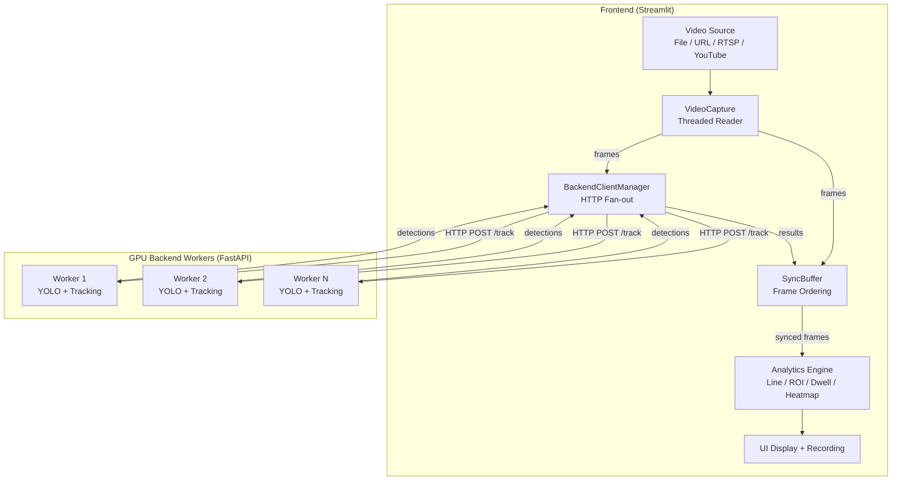

<div align="center">

# 🎥 OpenVideoAnalytics

**Real-time distributed YOLO video analytics — decoupled enterprise pipeline with Redis pub/sub, WebSocket gateway, and React command-center UI.**

[](https://python.org)
[](LICENSE)
[](#)
[](https://vitejs.dev)
[](https://fastapi.tiangolo.com)
[](https://redis.io)
[](https://docs.ultralytics.com)

</div>

---

## 🚀 New Architecture (v2) — Decoupled Pipeline

```
Camera / File
     │
     ▼
┌─────────────────────────┐
│  Inference Worker        │  Python · YOLO · OpenCV · CUDA
│  inference_worker/       │  Reads RTSP / file, runs model.track()
└────────────┬────────────┘
             │  Redis Pub/Sub
             │  detections:{session_id}   ← JSON bboxes
             │  frames:{session_id}       ← JPEG bytes
             ▼
┌─────────────────────────┐
│  FastAPI Gateway         │  Python · FastAPI · asyncio
│  gateway/                │  Subscribes Redis → fans out via WebSocket
│                          │  MJPEG relay at /video/{id}/stream
└────────────┬────────────┘
             │  WebSocket  ws://localhost:8000/ws/{id}
             │  MJPEG      http://localhost:8000/video/{id}/stream
             ▼
┌─────────────────────────┐
│  React Frontend          │  Vite · Tailwind · Zustand
│  frontend/               │  <video> + <canvas> overlay
└─────────────────────────┘
```

### ⚡ Quickstart (v2)

**Prerequisites:** Docker + Docker Compose, Node.js ≥ 16, Python 3.10+

```bash
# 1. Copy env file
copy .env.example .env        # Windows
# cp .env.example .env        # Linux/Mac

# 2. Add your video source in .env
# VIDEO_SOURCE=rtsp://...  or  VIDEO_SOURCE=D:/videos/sample.mp4

# 3. Start Redis + Gateway (+ optionally the worker)
docker compose up redis gateway

# 4. Start the Inference Worker locally (GPU machine)
cd inference_worker
pip install -r requirements.txt
python worker.py

# 5. Start the React UI
cd ../frontend
npm install
npm run dev
# → Open http://localhost:5173
```

> **No Docker?** Run Redis via `docker run -d -p 6379:6379 redis:7-alpine`, then start gateway and worker as Python processes directly.

### Project Structure (v2)

```
OpenVideoAnalytics/
├── inference_worker/        # Standalone YOLO worker → publishes to Redis
│   ├── worker.py            # Main capture + inference loop
│   ├── config.py            # Pydantic Settings (env vars)
│   ├── Dockerfile
│   └── requirements.txt
├── gateway/                 # FastAPI WebSocket gateway + MJPEG relay
│   ├── main.py
│   ├── Dockerfile
│   └── requirements.txt
├── frontend/                # React + Vite + Tailwind command-center UI
│   └── src/
│       ├── store.js         # Zustand WebSocket state
│       ├── App.jsx          # 3-column layout
│       └── components/
│           ├── VideoPlayer.jsx      # MJPEG stream display
│           ├── DetectionCanvas.jsx  # Canvas bbox overlay
│           ├── ControlPanel.jsx     # Source/model/session config
│           └── AlertFeed.jsx        # Live detection event list
├── docker-compose.yml       # Redis + Gateway + Worker
├── .env.example             # Environment variable template
│
│── ── Legacy Streamlit mode (v1 — unchanged) ──────────────────
├── app.py                   # streamlit run app.py
├── worker/server.py         # FastAPI HTTP GPU inference server
├── src/                     # Streamlit UI + analytics engine
├── config.yaml              # Backend registry
└── requirements_*.txt
```

---


---

> **Note:** When cloning or forking, you can clone into a directory named `OpenVideoAnalytics`.

## ✨ What is this?

A production-grade platform that distributes video inference across multiple GPU servers, aggregates results with strict frame ordering, and runs real-time spatial analytics — all through an interactive Streamlit dashboard.

Unlike typical single-machine YOLO demos, this system is built for **multi-stream, multi-model deployments** where inference is offloaded to dedicated GPU workers over the network.

---

## 🚀 Key Features

| Feature | Description |
|---|---|
| **Distributed Inference** | Fan-out frames to multiple GPU backends simultaneously over HTTP |
| **Object Tracking** | Persistent track IDs across frames via YOLO's built-in tracker |
| **Line Counting** | Draw lines on video, count IN/OUT crossings with direction control |
| **ROI Congestion** | Define polygonal zones, monitor congestion levels (Low/Medium/High) |
| **Dwell Time** | Track how long objects stay in a zone with alert thresholds |
| **Heatmap** | Accumulative density visualization with configurable decay |
| **Detection Only Mode** | Lightweight mode — just detection boxes, no analytics overhead |
| **Multi-Stream Capable** | Run multiple instances against a shared GPU backend pool — each processing a separate video source with independent analytics |
| **Multi-Model Support** | CCTV, Dashcam, GoPro source presets with model mapping |
| **OBB Support** | Oriented Bounding Box models (DOTA/satellite imagery) |
| **Segmented Recording** | Auto-split output videos by duration, AVI→MP4 conversion via FFmpeg |
| **GPU-Accelerated Decode** | JPEG decoding directly on CUDA with CPU fallback |
| **Session Management** | Auto-cleanup of idle sessions, max concurrency limits |
| **Stream Reconnect** | Auto-reconnects dropped RTSP/HTTP streams |
| **YouTube Support** | Direct YouTube URL input via yt-dlp |
| **Crash Recovery** | Recovers in-progress recordings after unexpected shutdowns |

---

## 🏗️ Architecture



**Data Flow:**
1. `VideoCapture` reads frames in a background thread
2. Frames are sent to all matching backend workers simultaneously
3. Backend workers run `YOLO.track()` on GPU and return detections
4. `SyncBuffer` aggregates results and enforces strict frame ordering
5. The playback loop applies analytics, renders visualizations, and records to disk

---

## 🛠️ Tech Stack

| Layer | Technology |
|---|---|
| Frontend | Streamlit, OpenCV, NumPy |
| Backend | FastAPI, Ultralytics YOLO, PyTorch, torchvision |
| Communication | HTTP/REST (httpx async client) |
| Video I/O | OpenCV, FFmpeg, yt-dlp |
| GPU Acceleration | CUDA, torchvision JPEG decode |

---

## ⚡ Quick Start

### Prerequisites

- Python 3.10+
- NVIDIA GPU with CUDA (for backend workers)
- FFmpeg (for video segment conversion)
- yt-dlp (optional, for YouTube URL support)

### 1. Clone the Repository

```bash
git clone https://github.com/YOUR_USERNAME/OpenVideoAnalytics.git
cd OpenVideoAnalytics
```

### 2. Start a Backend Worker

On each GPU machine:

```bash
pip install -r requirements_backend.txt
```

Place your YOLO model weights (`.pt` files) in a `models/` directory, then start the worker:

```bash
python worker/server.py
```

The worker starts on `http://0.0.0.0:8000` by default. You can set a custom model directory:

```bash
set VIDEO_INFERENCE_MODEL_DIR=C:\path\to\models
python worker/server.py
```

### 3. Configure Backends

Edit `config.yaml` to register your backend workers:

```yaml
backends:
  - url: "http://localhost:8000"
    model: "yolov8x"
    name: "local-gpu"
```

### 4. Start the Frontend

```bash
pip install -r requirements_frontend.txt
streamlit run app.py
```

### 5. Use the Dashboard

1. Select a **source type** (CCTV, Dashcam, etc.)
2. Choose **operation(s)** (detection model)
3. Upload a video or paste a URL
4. Enable analytics: draw lines, ROI zones, or dwell zones on the preview
5. Click **Start Processing**

---

## 📹 Multi-Stream Deployment

To monitor multiple cameras simultaneously, run separate Streamlit instances on different ports — all sharing the same GPU backend pool:

```bash
# Terminal 1 — Camera 1
streamlit run app.py --server.port 8501

# Terminal 2 — Camera 2
streamlit run app.py --server.port 8502

# Terminal 3 — RTSP Stream
streamlit run app.py --server.port 8503
```

Each instance gets its own session on the backend workers. The `SessionManager` supports up to 5 concurrent sessions per GPU, with automatic cleanup of idle sessions.

---

## ⚙️ Configuration

All backend connections and global settings are defined in [`config.yaml`](config.yaml):

```yaml
backends:
  - url: "http://localhost:8000"    # Backend worker URL
    model: "yolov8x"               # Model name (must match .pt filename on worker)
    name: "gpu-1"                   # Display label

buffer_size: 300                    # Playback buffer size (frames)
target_fps: 30                      # Target processing FPS
re_entry_cooldown: 30               # Frames before re-counting same object on a line
```

You can register multiple backends with different models for different source types (CCTV, Dashcam, etc.).

---

## 📁 Project Structure

```
OpenVideoAnalytics/
├── app.py                           # Entry point: streamlit run app.py
├── src/                             # Core application package
│   ├── sidebar.py                   # Sidebar configuration UI
│   ├── preview.py                   # Interactive preview & annotation drawing
│   ├── processing.py                # Producer-consumer pipeline & recording
│   ├── backend_client.py            # HTTP client for backend communication
│   ├── video_capture.py             # Threaded video capture (files, RTSP, YouTube)
│   ├── sync_buffer.py               # Frame synchronization buffer
│   ├── analytics.py                 # Analytics orchestrator (line/ROI/dwell/heatmap)
│   ├── line_counter.py              # Line crossing detection & counting
│   ├── roi_congestion.py            # ROI congestion & dwell time tracking
│   ├── visualization.py             # HUD-style rendering (corner brackets, overlays)
│   └── utils.py                     # Config loading, URL helpers
├── worker/                          # Backend worker (deploy on GPU machines)
│   └── server.py                    # FastAPI GPU inference server
├── tests/                           # Unit tests (pytest)
│   ├── test_line_counter.py         # 17 tests: crossing, cooldown, filtering
│   ├── test_sync_buffer.py          # 17 tests: ordering, namespacing, playback
│   └── test_roi_congestion.py       # 19 tests: congestion, dwell, ID recovery
├── .github/workflows/test.yml       # CI: runs tests on push/PR
├── config.yaml                      # Backend registry & global settings
├── requirements_backend.txt         # Backend dependencies
├── requirements_frontend.txt        # Frontend dependencies
├── .gitignore                       # Git exclusions
├── README.md                        # This file
├── DEPLOYMENT_GUIDE.md              # Detailed deployment instructions
└── LICENSE                          # MIT License
```

---

## 🤝 Contributing

Contributions are welcome! Here are some ways to help:

- 🐛 Report bugs or suggest features via [Issues](../../issues)
- 🔧 Submit pull requests for improvements
- 📖 Improve documentation or add examples
- ⭐ Star the repo if you find it useful!

---

## 📄 License

This project is licensed under the MIT License — see the [LICENSE](LICENSE) file for details.

---

## 👤 Author

**Raghav Sharma**

---

<div align="center">

*If you find this project useful, please consider giving it a ⭐!*

</div>
